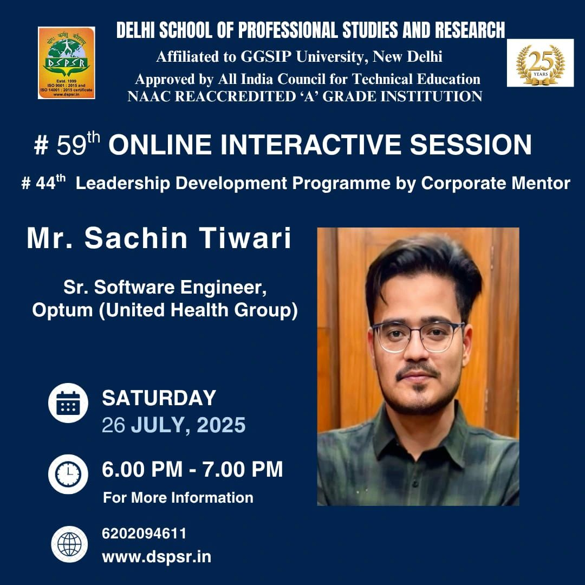
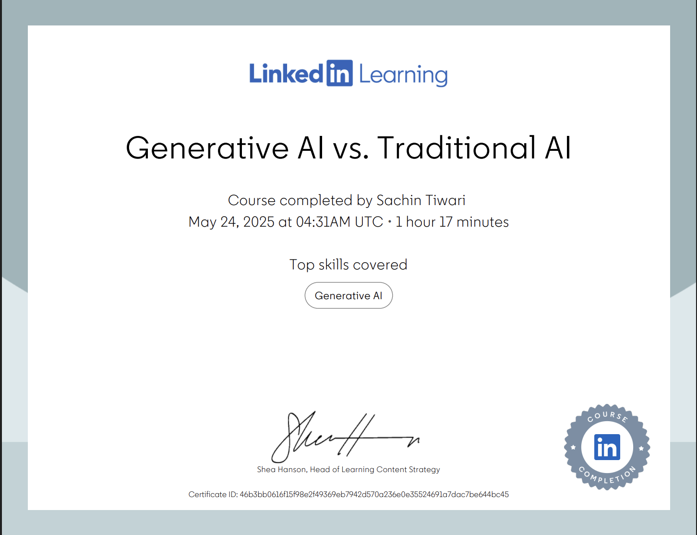
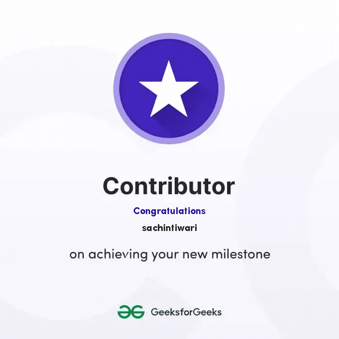

---
hide:
  - navigation
  - toc
---

# REWARDS & RECOGNITIONS

## :material-youtube: Watch me on YouTube

[{ width=250 }](https://www.youtube.com/watch?v=Z0YGmU19qcw&t=11s)

## :trophy: Optum Rewards

- Optum Superhero Nominee for holistic year wise performance
- 15 Internal Bravo Awards

## :material-certificate: Certifications

---

<figure markdown="span">
[{ width=200 }](https://www.credly.com/badges/47fce8d4-e008-46a9-8405-e0db93b691b0)
<figcaption>AZ-900</figcaption>
</figure>

<figure markdown="span">
[{ width=250 }](https://www.linkedin.com/learning/certificates/46b3bb0616f15f98e2f49369eb7942d570a236e0e35524691a7dac7be644bc45?trk=share_certificate)
<figcaption>GenAI vs Traditional AI</figcaption>
</figure>

<figure markdown="span">
[{ width=200 }](https://media.geeksforgeeks.org/badges_dir/7ad8608353ea969a46c1d2d4d88d90e47b730d83a8b44ea4f849ab29bc67bb1b.png)
<figcaption>GeeksForGeeks Contributor</figcaption>
</figure>

 

<!-- [ Back to Home](./index.md){ .md-button } -->
